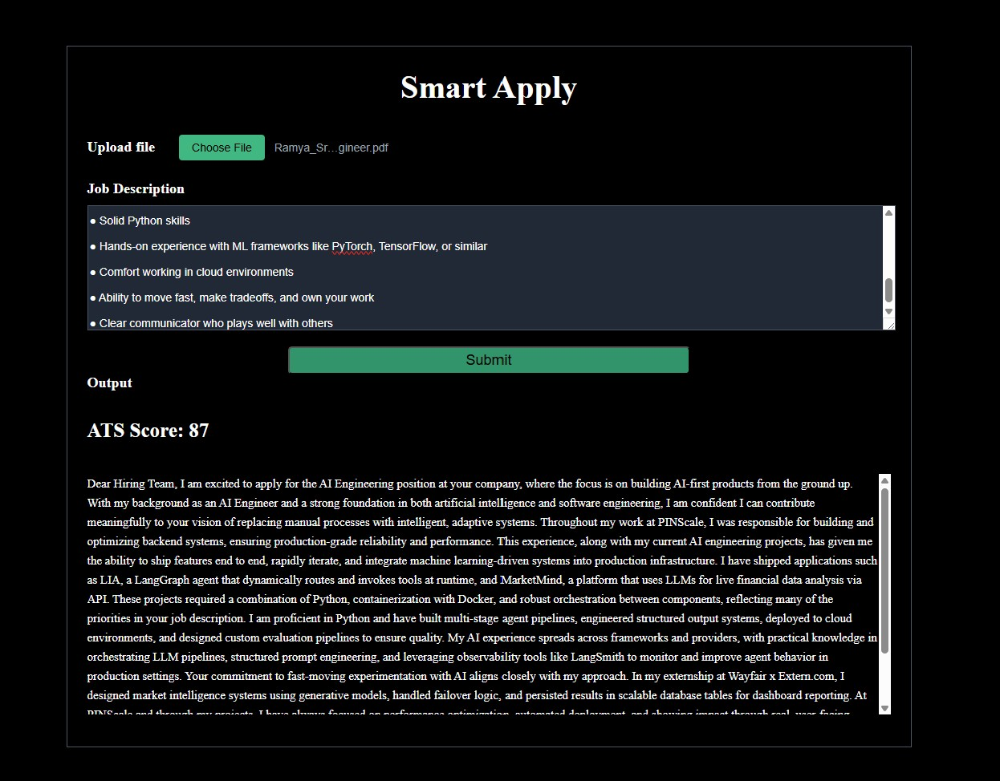

# SmartApply — AI Job Application Assistant

SmartApply is an AI-powered web app that analyzes resume-to-job-description match and generates personalized cover letters using large language models. Built to demonstrate practical AI engineering skills including prompt engineering, structured LLM outputs, and PDF parsing pipelines.

## AI Features

- **ATS Scoring** — LLM evaluates resume match based on weighted criteria: keywords (30%), skills (30%), experience (25%), education (15%)
- **Personalized Cover Letter Generation** — GPT-4.1 generates tailored cover letters grounded strictly in resume content, no hallucinated experience
- **Structured JSON Outputs** — prompt engineering ensures consistent, parseable LLM responses every time
- **PDF Parsing Pipeline** — raw binary PDF → extracted text → LLM context

## Tech Stack

| Layer | Technology |
|-------|-----------|
| LLM | OpenAI GPT-4.1 |
| Backend | FastAPI (Python) |
| Frontend | React + Vite |
| PDF Parsing | pypdf |
| Containerization | Docker + Docker Compose |
| Web Server | Nginx |

## AI Engineering Highlights

**Prompt Engineering** — Designed a system prompt with explicit scoring criteria, content constraints (no fabricated experience), and output format enforcement. Result: consistent, structured JSON responses across varied inputs.

**Structured Outputs** — Rather than free-form text, the LLM returns `{"ats_score": int, "cover_letter": string}` every time. Enforced through prompt design without using OpenAI's structured output API — demonstrating prompt-level control.

**Context Design** — Resume text and job description are composed into a single user message with clear semantic separation, giving the model full context for both scoring and generation in one inference call.

## How to Run

**Prerequisites:** Docker and Docker Compose installed.

1. Clone the repo
```bash
   git clone https://github.com/Sruthi-Pedakolimi/smart-apply.git
   cd smart-apply
```

2. Create a `.env` file:
```
   OPEN_API_KEY=your_openai_key_here
   OPENAI_BASE_URL=https://api.openai.com/v1
```

3. Run:
```bash
   docker compose up --build
```

4. Open `http://localhost:3000`

## Screenshots

### Main Screen


### Output


## Author

Sruthi Pedakolimi — [GitHub](https://github.com/Sruthi-Pedakolimi) | [LinkedIn](https://linkedin.com/in/sruthi-pedakolimi)